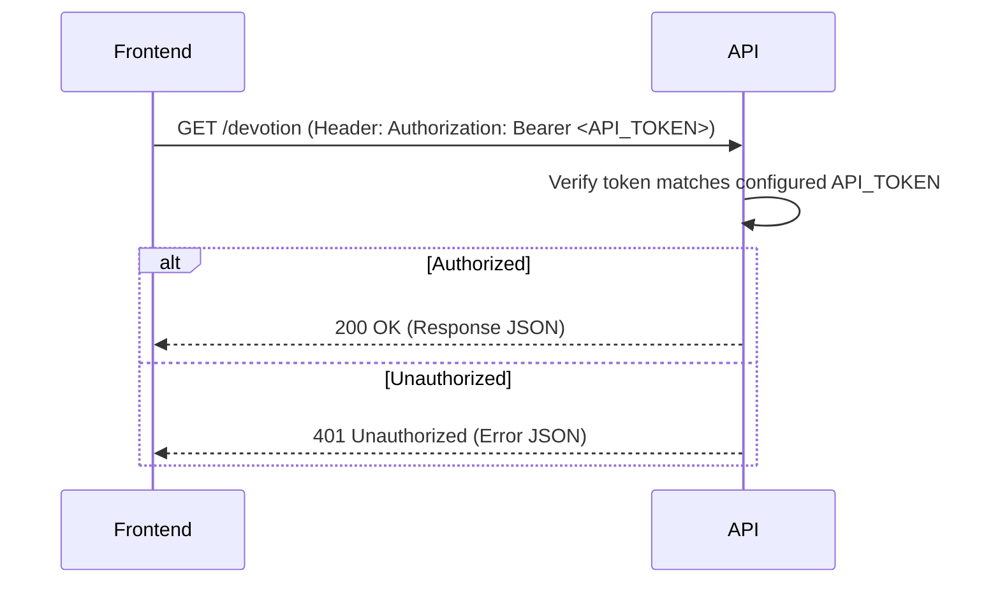

# Devotion API - Frontend Authentication & Integration Guide

This guide explains how to authenticate with the Devotion API using a pre-configured API Token and documents all available endpoints.

---

## Authentication Flow Overview

The Devotion API is protected using a static API token to keep frontend integration simple:

1. **Obtain Token:** The administrator generates or defines an API token.
2. **Configure Backend:** Set the `API_TOKEN` environment variable on the server.
3. **Include in Requests:** The frontend sends this token in the `Authorization` header of all protected requests as a Bearer token: `Authorization: Bearer <API_TOKEN>`.



---

## Backend Configuration

To set the API token, add the `API_TOKEN` environment variable to your `.env` file in the root directory:

```env
API_TOKEN=your_strong_api_token_here
```

---

## API Documentation

### Base URL
All API requests are made relative to the server address (e.g., `http://localhost:8080`).

---

### Protected Endpoints

> [!IMPORTANT]
> All endpoints below require the HTTP Header: `Authorization: Bearer <your_api_token>`

#### 1. Get Daily Devotion
Retrieves a complete Catholic devotional (mass readings, papal quote, and theological context) for a specific date.
* **Endpoint:** `/devotion`
* **Method:** `GET`
* **Query Parameters:**
  * `date` (optional, format: `YYYY-MM-DD`. Defaults to the current date)
* **Success Response:**
  * **Code:** `200 OK`
  * **Content:**
    ```json
    {
      "first_reading": {
        "citation": "Genesis 1:1-19",
        "context": "Spiritual and historical context of the text...",
        "text": "In the beginning..."
      },
      "responsorial_psalm": {
        "citation": "Psalm 104",
        "text": "Bless the Lord, O my soul..."
      },
      "second_reading": {
        "citation": "Romans 8:1-10",
        "context": "Context details...",
        "text": "There is therefore now no condemnation..."
      },
      "gospel": {
        "citation": "John 1:1-18",
        "context": "Context details...",
        "text": "In the beginning was the Word..."
      },
      "pope_quote": "Quote of the day from the Holy Father..."
    }
    ```
* **Error Responses:**
  * **Code:** `401 Unauthorized` (Missing/invalid token)
  * **Code:** `500 Internal Server Error` (Server missing `API_TOKEN` env config)

#### 2. Get Bible Passage Text
Retrieves word-for-word text for a specific Bible passage.
* **Endpoint:** `/bible`
* **Method:** `GET`
* **Query Parameters:**
  * `passage` (required, e.g. `John 3:16` or `Genesis 1:1-5`)
* **Success Response:**
  * **Code:** `200 OK`
  * **Content:**
    ```json
    {
      "content": "For God so loved the world...",
      "copyright": "Scripture quotations are from..."
    }
    ```

#### 3. Get Bible Passage Context
Retrieves historical and theological context for a scripture passage.
* **Endpoint:** `/context`
* **Method:** `GET`
* **Query Parameters:**
  * `passage` or `citation` (required, e.g. `John 3:16`)
* **Success Response:**
  * **Code:** `200 OK`
  * **Content:**
    ```json
    {
      "citation": "John 3:16",
      "context": "This verse is widely considered a summary of the central theme of Christianity..."
    }
    ```

---

## Frontend Integration Example (JavaScript Fetch)

Here is a simple example showing how to request devotion data using your pre-configured API Token:

```javascript
const BASE_URL = 'http://localhost:8080';
const API_TOKEN = 'your_strong_api_token_here'; // Save this in your frontend build env variables

async function fetchDevotion(date = '') {
  const url = date ? `${BASE_URL}/devotion?date=${date}` : `${BASE_URL}/devotion`;
  
  const response = await fetch(url, {
    method: 'GET',
    headers: {
      'Authorization': `Bearer ${API_TOKEN}`,
      'Accept': 'application/json'
    }
  });

  const data = await response.json();

  if (response.status === 401) {
    console.error('Authentication failed: Invalid or missing token');
    alert('Unauthorized access. Please check your API Token configuration.');
    return null;
  }

  if (!response.ok) {
    throw new Error(data.error || 'Failed to fetch devotion');
  }

  return data;
}

// Usage:
// fetchDevotion('2026-06-30')
//   .then(data => console.log('Devotion data:', data))
//   .catch(err => console.error('Error:', err));
```

## Troubleshooting Authentication Errors

* **`401 Unauthorized`:**
  * **Missing Authorization header:** The `Authorization` header was not sent.
  * **Invalid Authorization header format:** Ensure the header is formatted as `Bearer <token>` (with a single space between "Bearer" and the token).
  * **Invalid API token:** The sent token does not match the server's configured `API_TOKEN`.
* **`500 Internal Server Error`:**
  * **Server configuration error:** The server was started without the `API_TOKEN` environment variable being populated. The server logs will show `[apiTokenMiddleware] WARNING: API_TOKEN environment variable is not set`. Set it in your `.env` or system environment.
